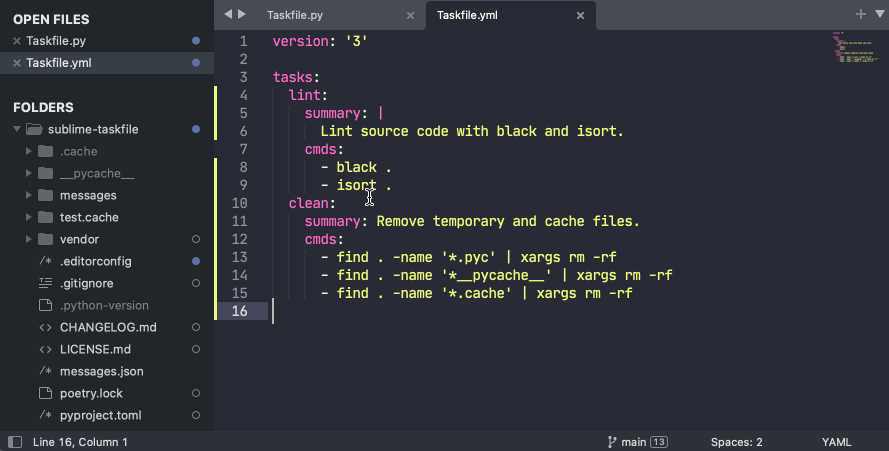

# Sublime Taskfile

A Sublime Text 4 plugin for running tasks from [Taskfile](https://taskfile.dev). It adds `Taskfile: Run Task` to your command palette and you can select which task to run. The output of the task is than displayed in the quick panel on the bottom.

It is also possible to initialize the `Taskfile` with `Taskfile: Init` command, which basically does `task -i` in one of the project directories you chose.

## Caveats

- made for Sublime Text 4
- uses [Sublime's python version 3.8](https://www.sublimetext.com/docs/api_environments.html#selecting_python_version)
- uses [`pyyaml`](https://github.com/packagecontrol/pyyaml) dependency
- as a result of the above dependency local development can be difficult, but you can try executing `sys.path.append('/Users/<user>/Library/Application Support/Sublime Text/Packages/pyyaml/st3/yaml')`

## Installation

Use `Package Control: Install Package` command and search for `Taskfile`.

## Contributing

You are welcome to submit pull requests with bug fixes and improvements.

Please lint your files with `black` before submition.
